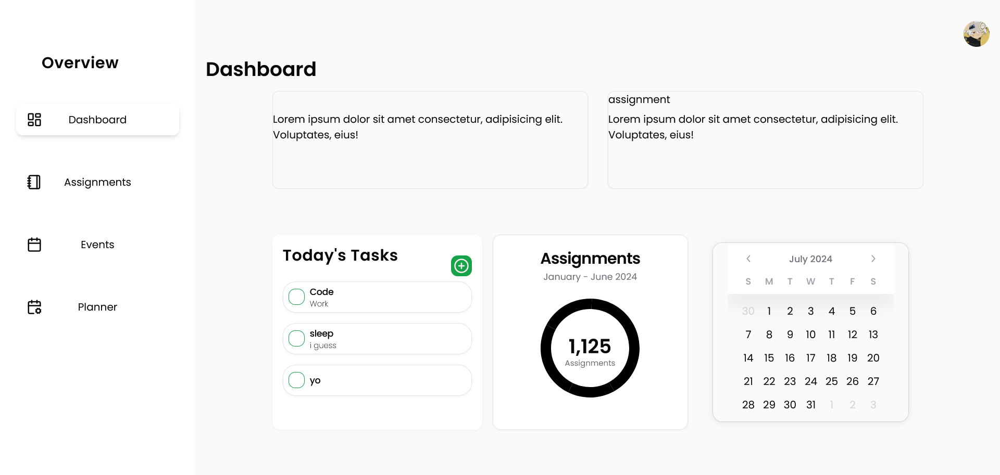

# Katei: A Student's Study Companion

Overview

Katei is a web application built with Next.js and TypeScript designed to help students effectively manage their assignments and tasks. It provides a user-friendly interface for creating, organizing, and tracking academic commitments.
Features

    Assignment Management:
        Create, edit, and delete assignments with due dates, descriptions, and priority levels.
        Organize assignments by course or subject.
        Set reminders for upcoming deadlines.
    Task Management:
        Break down large assignments into smaller, actionable tasks.
        Track task completion and progress.
    Calendar Integration:
        Visualize assignments and deadlines on a calendar.
        Sync with Google Calendar or other calendar services (optional).

Technology Stack

    Next.js, TypeScript, React, Tailwind CSS, Neon DB

Getting Started

    Clone the repository:
    Bash

    git clone https://github.com/your-username/katei.git

    Use code with caution.

Install dependencies:
Bash

cd katei
npm install

Use code with caution.
Development server:
Bash

npm run dev

Use code with caution.
This will start a development server at http://localhost:3000

### Contribute to Katei

If you want to add some features or have better ways to implement features feel free to contribute to katei.
## Screenshots

